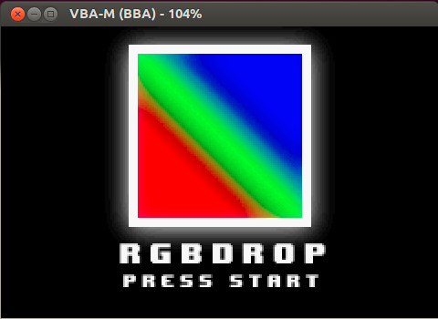
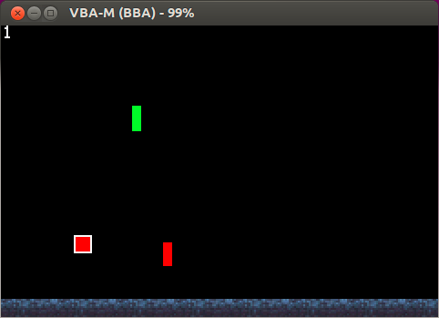
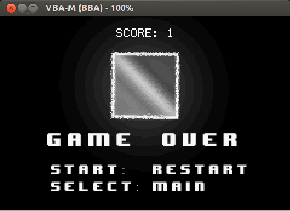

# RGBDROP
### GameBoyGame for CS2110

### CONTROLS
START 	| START GAME
SELECT	| RESTART GAME
A		| SPEED DROP
B		| CHANGE COLORS

### OBJECTIVE 
GAIN THE HIGHEST SCORE BY HITTING COLORED RECTANGLES WITH YOUR CHARACTER THAT CORRESPOND TO YOUR CHARACTER'S CURRENT COLOR WHILE DODGING THE RECTANGLES THAT ARE NOT YOUR CURRENT COLOR.

FOR EXAMPLE:
- HITTING A GREEN RECTANGLE WHILE YOUR CHARACTER IS GREEN WILL GIVE YOU A POINT.
- HITTING A GREEN RECTANLGE WHILE YOUR CHARACTER IS NOT GREEN WILL END THE GAME.

YOUR CHARACTER WILL BOUNCE UP AND DOWN IN A GIVEN PATH UNLESS YOU PRESS A, WHICH DROPS YOUR CHARACTER SUPER AT AN ACCELLERATED PACE UNTIL IT COLLIDES WITH THE GROUND.

YOU SWITCH THROUGH COLORS EVERY TIME YOU PRESS B, FROM RED -> GREEN -> BLUE, AND THEN BACK TO RED AGAIN.

NOTE: YOU CANNOT MOVE YOUR CHARACTER LEFT OR RIGHT. THIS IS A FEATURE NOT A BUG.

ENJOY!

PROGRAMMED IN C WITH TEARS AND SADNESS OVER A MILLION BUGS
- "WAIT WHAT DO YOU MEAN SIZEOF DOESN"T WORK FOR SIZES OF ARRAYS?"
- "WHAT THE HELL IS THE DIFFERENCE BETWEEN -> AND . ???"

### Running the game
To run it, download the RGBDROP.gba file. You need to download a VBA-M emulator and run the RGBDROP.gba file.

Alternatively you can download the CS2110 tools for georgia tech that'll allow you to call `make vba` and automatically run the files.

